# Architecture

This section details the technical architecture of our RISC Zero + Cartesi integration, focusing on the interaction between components and the proof verification flow.

## System Components

The integration consists of three main components that work together to generate and verify zero-knowledge proofs:



The process begins when the **Host** prepares private inputs and the **Guest** performs confidential computation, after which RISC Zero generates and serializes a cryptographic proof receipt. Finally, **the Cartesi Machine** deserializes the receipt, and its verifier program validates the proof.

### 1. RISC Zero Host Program

The host program orchestrates the proof generation process:

```rust
// Example host program structure
fn main() {
    // Configure proving method (local or remote)
    let prover = default_prover();

    // Initialize zkVM with private inputs
    let env = ExecutorEnv::builder()
        .write(&private_input)
        .build()
        .unwrap();

    // Generate proof (returns Composite(default), Succinct, or Groth16 receipt)
    let receipt = prover
        .prove_with_opts(env, GUEST_ELF, &ProverOpts::default())
        .unwrap();

    // Serialize receipt for Cartesi verification
    let receipt_bytes = bincode::serialize(&receipt).unwrap();
}
```

**Key responsibilities:**

- Manages the proof generation pipeline (proof strategy, receipt type, resources)
- Prepares private inputs and serializes proof data for Cartesi verification

### 2. RISC Zero Guest Program

The guest program defines the computation to be proven:

```rust
use risc0_zkvm::guest::env;

fn main() {
    // Read private inputs
    let private_data: Vec<u8> = env::read();

    // Perform confidential computation
    let result = process_private_data(private_data);

    // Optional: Verify computation constraints
    verify_constraints(&result)?;

    // Commit public outputs to journal
    env::commit(&result);
}
```

**Design considerations:**

- Optimizes for efficient proving with clear I/O boundaries
- Implements selective disclosure and STARK-based proof generation

### 3. Cartesi Verifier

The verifier program runs inside the Cartesi Machine and validates RISC Zero proofs:

```rust
fn main() {
    // Read serialized receipt from Cartesi input drive
    let receipt_bytes = read_from_input_drive();
    let receipt: Receipt = deserialize(&receipt_bytes)?;

    // Verify cryptographic proof
    match receipt.verify(RISC0_IMAGE_ID) {
        Ok(journal) => {
            // Process verified public outputs
            handle_verified_result(journal);
            emit_verification_success();
        },
        Err(e) => emit_verification_failure(e),
    }
}
```

**Verification capabilities:**

- Validates cryptographic proofs across all RISC Zero receipt types
- Manages verification state and reports results to the rollup
